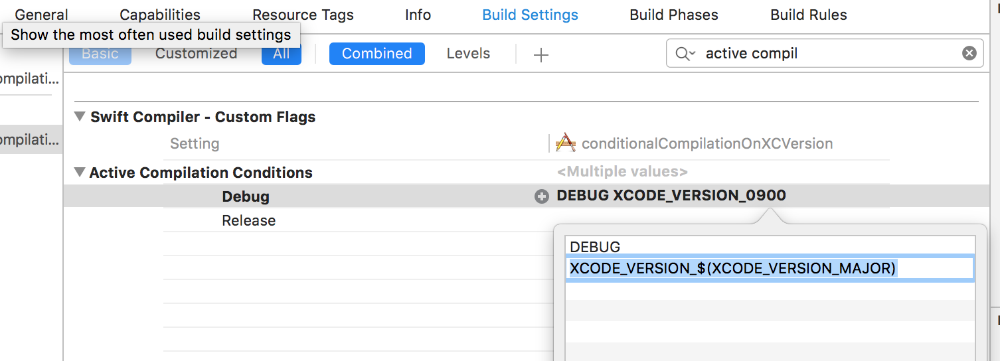

# How to conditionally compile Swift code based on the Xcode version

[](https://travis-ci.org/csknns/conditionalCompilationOnXCVersion)

**conditionalCompilationOnXCVersion** is an iOS Xcode project to demonstrate how to conditionally compile Swift code based on the Xcode version

## The problem

You have an API that is available for a new SDK version and you need to compile the code that uses it only for that version of Xcode.

## The solution

You can include a Active Compilation Condition (a -D swift compile flag) that this name is dynamically create based on the Xcode version. Xcode already provides the  build setting XCODE_VERSION_MAJOR that resolves to the current Xcode version( e.g. 0900 for Xcode 9).
So you can add an an Active Compilation Condition with name ```XCODE_VERSION_$(XCODE_VERSION_MAJOR)``` that will resolve to the flag ```XCODE_VERSION_0900``` for Xcode 9.

For example in your target's Build Settings: 



## Author

Christos Koninis, christos.koninis@gmail.com
